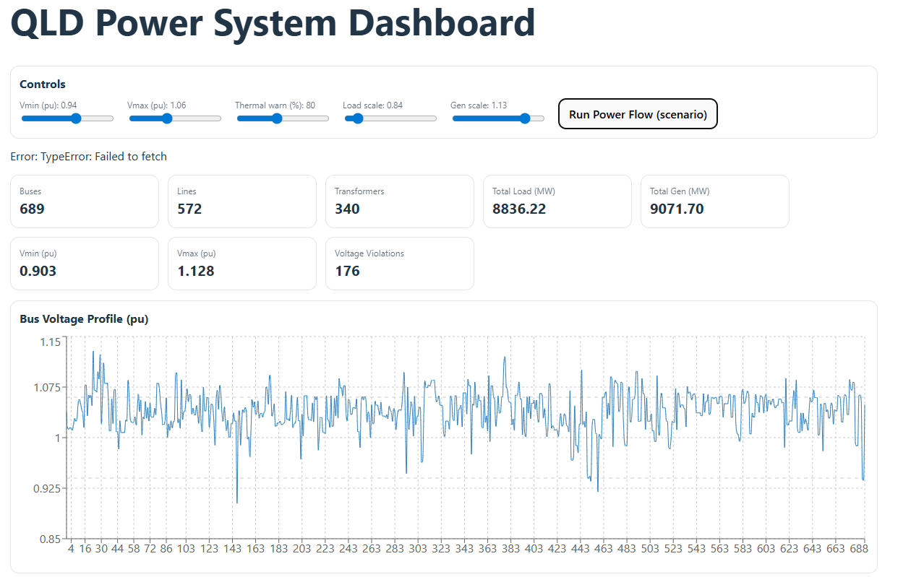

# Power System Dashboard (FastAPI + Pandapower + React)

This repository presents a web-based power system analysis dashboard developed using Pandapower, FastAPI, and React for large-scale transmission network studies. The tool enables visualisation and analysis of key network performance indicators, including bus voltage profiles, line loading, and transformer utilisation, using a Queensland network model derived from National Electricity Market (NEM) datasets provided by CSIRO. 
It supports scenario-based analysis by allowing users to scale load and generation, helping to assess how different operating conditions impact network performance and constraint violations. It transforms raw power system simulation outputs into actionable insights for real-time decision-making and future planning. At this stage, the tool primarily serves as a planning and analysis platform. However, it is designed to be extended into an operational decision-support system by integrating real-time data, forecasting, and advanced analytics, enabling dynamic management of modern power systems with high penetration of renewable and distributed energy resources.


Process flow:
•	Loads the matpower case file from the network model for the National Electricity Market (NEM) of Australia datasets from a public GitHub repository  (https://github.com/csiro-energy-systems/Synthetic-NEM-2000bus-Data). It contains a synthetic network model with 2000 buses across all states, and separate files for each state.  
•	Runs pandapower powerflow model in Python and exposes results via a FastAPI backend (JSON API). The results will then be displayed as KPIs and plots in a React dashboard. KPIs include bus voltage profiles, line loading, and transformer utilisation. 
•	The KPIs can be changed using scaling load and the generation of the power networks. 

---

## Features

- Power flow simulation using Pandapower
- FastAPI backend with JSON APIs
- React frontend with interactive charts
- Scenario analysis (load/generation scaling)
- Contingency analysis (line/trafo outages)
- KPI-based monitoring

---

## Use Case

- Transmission planning studies
- DER impact assessment
- Dynamic Operating Envelope (DOE) analysis
- Scenario-based network analysis

---

## Project Structure

## 📁 Project Structure

```
qld-dashboard/
│
├── backend/
│   ├── main.py
│   ├── requirements.txt
│   └── (other Python modules)
│
├── frontend/
│   ├── package.json
│   ├── src/
│   │   ├── App.jsx
│   │   └── components/
│   └── node_modules/
│
└── README.md
```

## Prerequisites

- Python 3.9+
- Node.js (v16 or higher)
- npm

## requirements.txt
fastapi
uvicorn
pandapower
numpy

## Run backend server
**Step 1 -  Backend (FastAPI + Pandapower)**

**Step 2 — Open Command Prompt (CMD)**

**Step 3 — Go to backend folder**
```
cd /d "C:\Users\USER\OneDrive\Desktop\qld-dashboard\backend"

## Step 4: Install dependencies
python -m pip install -r requirements.txt 

## Step 5: start backend server
python -m uvicorn main:app --reload --port 8000 

##Step 6 — Check backend API
Open in your browser:

http://127.0.0.1:8000/api/results

If JSON outputs there, the backend is running correctly.
```


## Run frontend server for visualization
 ** Step 1 - Open a NEW Command Prompt (CMD) window**
 ** Step 2 - cd /d "C:\Users\USER\OneDrive\Desktop\qld-dashboard\frontend"**
 ** Step 3 - Install Node dependencies**
            npm install
 ** Step 4 - Start the frontend**
            npm run dev
        
 ** Step 3: Open the dashboard in browser**
            http://localhost:5173

If the page opens and charts load, the frontend is running correctly.




## Author
**Ashish Kumar Karmaker, Research Engineer, James Cook University**
